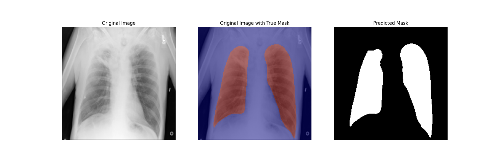
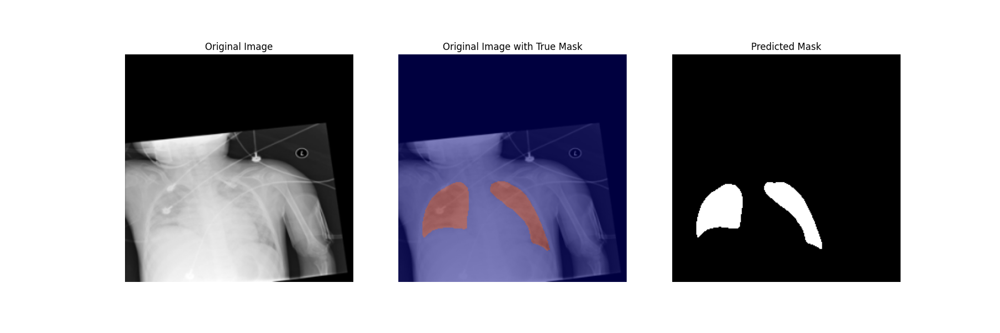

# **Lung Segmentation with GAN-Enhanced U-Net**

## 🫁 Project Overview
This project implements lung segmentation from chest X-ray images using a U-Net architecture enhanced with Generative Adversarial Network (GAN) training. The goal is to accurately segment lung regions across different pathological conditions including COVID-19, Viral Pneumonia, and Lung Opacity cases.

## 🚀 Quick Start

### Prerequisites
- Python 3.8+
- TensorFlow 2.x
- NumPy
- Matplotlib
- Pandas
- scikit-learn

### Installation
```bash
git clone https://github.com/yourusername/lung-segmentation-gan-unet.git
cd lung-segmentation-gan-unet
pip install -r requirements.txt
```

### Dataset Setup
Download the dataset from Google Drive:
```bash
# Download from: https://drive.google.com/file/d/1-zpDuR_rD4ZtHe2zz_YaEglE_-yVl1U7/view?usp=drive_link
# Extract to project directory
```

**Alternative**: Download from [Kaggle COVID-19 Radiography Database](https://www.kaggle.com/datasets/tawsifurrahman/covid19-radiography-database)

Expected directory structure:
```
data/
├── Normal/
│   ├── images/
│   └── masks/
├── COVID/
│   ├── images/
│   └── masks/
├── Viral Pneumonia/
│   ├── images/
│   └── masks/
└── Lung_Opacity/
    ├── images/
    └── masks/
```

### Running the Code
```bash
# Train baseline U-Net
python train_unet.py

# Train GAN-enhanced U-Net
python train_gan_unet.py

# Evaluate model
python evaluate.py
```

## 📊 Dataset
- **Categories**: Normal, COVID, Viral Pneumonia, Lung Opacity
- **Input**: 256x256 grayscale chest X-ray images
- **Output**: Binary segmentation masks (lung vs. background)
- **Split**: Stratified train/validation/test split to ensure balanced representation across all disease categories

## 🏗️ Model Architecture

### U-Net Generator
- **Encoder**: Progressively downsamples images while extracting hierarchical features
  - Conv blocks with ReLU activation
  - MaxPooling for downsampling
  - Feature channels: 64 → 128 → 256 → 512 → 1024
- **Bridge**: Bottleneck layer with highest-level abstract features
- **Decoder**: Upsamples while preserving fine details
  - Conv2DTranspose for upsampling
  - Skip connections concatenate encoder features with decoder features
  - Gradually reduces channels: 512 → 256 → 128 → 64
- **Output**: Single channel with sigmoid activation for binary segmentation

### GAN Enhancement
- **Discriminator**: CNN that distinguishes real masks from generated masks
- **Adversarial Training**: 
  - Generator loss = Adversarial loss + 100 × L1 loss
  - L1 loss ensures pixel-wise accuracy
  - Adversarial loss improves mask realism and boundary sharpness

## 🔧 Key Technical Features

### Skip Connections
- Direct connections from encoder to decoder at matching resolutions
- Preserves fine spatial details lost during downsampling
- Critical for precise boundary delineation in medical segmentation

### Data Augmentation
- Horizontal flips and rotations (0°, 90°, 180°, 270°)
- Brightness and contrast adjustments
- Gaussian noise injection
- Random scaling (0.8x to 1.2x)
- Ensures model robustness across different image variations

### Training Strategy
- **Phase 1**: Standard U-Net training with binary crossentropy
- **Phase 2**: GAN training with adversarial loss + L1 regularization
- Early stopping with validation IoU monitoring
- Model checkpointing for best performance

## 📈 Results

### Quantitative Results
| Model | Test Jaccard Score | Test Accuracy | Improvement |
|-------|-------------------|---------------|-------------|
| **Baseline U-Net** | 0.9687 | 0.9924 | - |
| **GAN-Enhanced U-Net** | **0.9757** | **0.9941** | +0.7% Jaccard, +0.17% Accuracy |

### Visual Results

#### Before GAN Enhancement
<p align="center">
  
  
</p>

#### After GAN Enhancement
<p align="center">
  
  
</p>

*The GAN-enhanced model shows improved boundary precision and more accurate lung region delineation, particularly in challenging cases with lung opacity.*

## 💡 Key Insights
The GAN enhancement provided modest but consistent improvements in segmentation quality, particularly in boundary precision. The adversarial training helps generate more realistic lung boundaries while the L1 loss maintains pixel-wise accuracy. This approach is particularly valuable for medical imaging where precise anatomical boundaries are critical for clinical applications.

## 📁 Project Structure
```
lung-segmentation-gan-unet/
├── models/
│   ├── unet.py           # U-Net architecture
│   └── discriminator.py  # GAN discriminator
├── utils/
│   ├── data_loader.py    # Data loading utilities
│   ├── augmentation.py   # Data augmentation
│   └── metrics.py        # Evaluation metrics
├── train_unet.py         # Standard U-Net training
├── train_gan_unet.py     # GAN-enhanced training
├── evaluate.py           # Model evaluation
├── requirements.txt      # Dependencies
└── README.md
```

## 🤝 Contributing
Contributions are welcome! Please feel free to submit a Pull Request.

## 📚 Citation
If you use this work in your research, please cite:
```bibtex
@article{lung_segmentation_gan_unet,
  title={Lung Segmentation with GAN-Enhanced U-Net},
  author={jprich1984},
  year={2024},
  journal={GitHub Repository},
  url={https://github.com/jprich1984/Lung_Segmentation}
}
```

## 🔗 References
- [COVID-19 Radiography Database](https://www.kaggle.com/datasets/tawsifurrahman/covid19-radiography-database)
- Ronneberger, O., Fischer, P., & Brox, T. (2015). [U-Net: Convolutional Networks for Biomedical Image Segmentation](https://arxiv.org/abs/1505.04597). arXiv preprint arXiv:1505.04597.
- Goodfellow, I., et al. (2014). [Generative Adversarial Networks](https://arxiv.org/abs/1406.2661). arXiv preprint arXiv:1406.2661.
